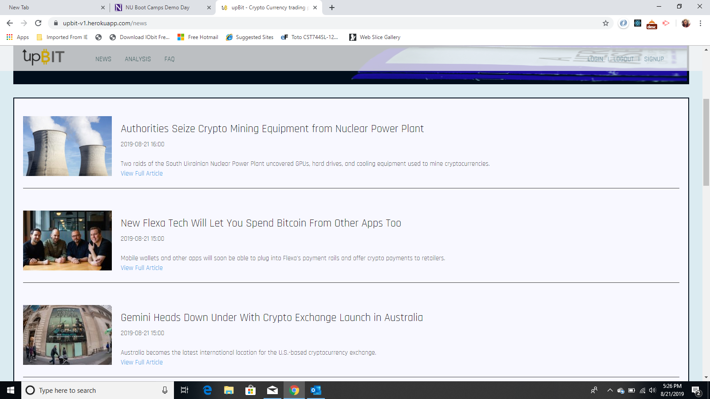

# upBit

Created for project 3 at Northwestern Bootcamp upBit is a interactive financial app tool that helps traders monitor and analyize crypto currency assets.  A custom API is created using sequelize and MYSQL database of historical data of these currencies using [Coinbase API](https://developers.coinbase.com/) and [Omenics](https://omenics.com/dashboard).  Omenics is a crytpo currency sentiment data analytics tool that aggregates news and sentiment on online platforms and gives a sent-score.  We also use Vader npm, sentiment indicator package to do analysis vs Omenics data.  Various scraping and charting npm packages are used to populate our custom API with news and data.

The app is created on React front-end, with sequelize Node express back-end using MVC architecture.  Passport JWT authorization is applied saving user data onto Mongodb.  

[Heroku Link](https://upbit-v1.herokuapp.com/)

[Demo Link](https://drive.google.com/file/d/1aDF-X-xB6eF7m2S9AK5EJ1kjxpvuBAh5/view)

## Screen Shots
Register

News

Pricing

Graph

Regression Graph

## Technologies 
- [Node.js](https://en.wikipedia.org/wiki/Node.js)
- [Materialize Framework](https://materializecss.com/)
- [Sequelize](http://docs.sequelizejs.com/)
- [MySQL](https://en.wikipedia.org/wiki/MySQL)
- [MongoDB](https://www.mongodb.com/)
- [Express.js Framework](https://expressjs.com/)
- [React](https://reactjs.org)
- [MVC -architecture](https://en.wikipedia.org/wiki/Model%E2%80%93view%E2%80%93controller)
- [NPM packages](https://www.npmjs.com/)
- [Passport Authentication](http://www.passportjs.org)

### To Run App

- Go to Terminal in VS Code command line input: npm install
- Start Mongodb by going to C: and line input: mongod
- Go to Terminal in VS Code command line input: npm start
- Goto Register 

## Project 3 - Accolades By Classroom Vote Awarded
Winner Most Awe Inspiring 63%  - [First Place Prize](https://drive.google.com/open?id=1022WP89pugTqxPqD5oE1mUStJE7R9jZUqwkuoqEsXbc)

Winner Best Use of Tech 44%

Winner Most Disruptive 38%

## Programming Team

**Joey Lansangan** - /Materialize/HTML/CSS/Frontend Visual Design - [Joey](https://joeylansangan.github.io/streetcode/)

**Sung Lee** - /Passport Authentication/News Scraping//NPM Packages/Routing and Backend JS - [Sung](https://sungsoolee2.github.io/developer-portfolio/)

**Kat Poulos** - /Sequelize MySQL/Graphing NPM packages/API implimentation/Routing and Backend JS - [Kat](https://www.linkedin.com/in/katerina-poulos-451a53189/)

